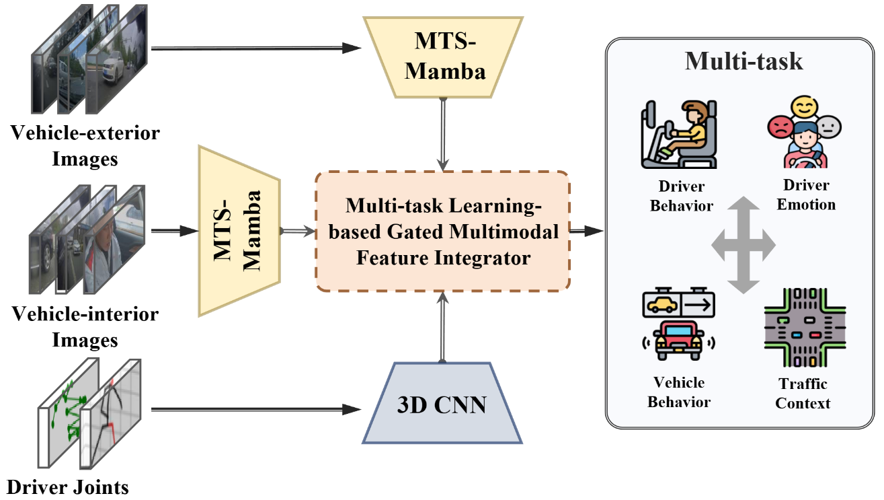

# TEM³-Learning: Time-Efficient Multimodal Multi-Task Learning Network for Assistive Driving

<div align="center">
  
</div>

## 简介 | Introduction

TEM³-Learning (Time-Efficient Multimodal Multi-Task Learning Network for Assistive Driving) 是一个新颖的多模态多任务学习框架，该框架利用多模态数据同时识别驾驶员情绪，行为，交通环境和车辆行为。在ADAS公开数据集上的实验表明，该框架仅以不到6M的参数量，在所有四个任务上均达到了SOTA。

TEM³-Learning (Time-Efficient Multimodal Multi-Task Learning Network for Assistive Driving) is a novel multimodal multi-task learning framework that leverages multimodal data to simultaneously recognize driver emotions, behaviors, traffic environments, and vehicle behaviors. Experiments on public ADAS datasets demonstrate that this framework achieves SOTA performance across all four tasks with less than 6M parameters.

## 环境搭建 | Environment Setup

### 系统要求 | System Requirements

- Python 3.7+
- CUDA 11.0+ (用于GPU加速 | for GPU acceleration)
- 24GB+ RAM

### 安装步骤 | Installation Steps

1. **克隆仓库** | **Clone the repository**

```bash
git clone https://github.com/Wenzhuo-Liu/TEM3-Learning.git
cd TEM3-Learning
```

2. **创建虚拟环境** | **Create a virtual environment**

```bash
# 使用 conda
conda create -n tem3 python=3.8
conda activate tem3

# 或使用 venv
python -m venv tem3_env
# 在 Windows 上激活
tem3_env\Scripts\activate
# 在 Linux/Mac 上激活
source tem3_env/bin/activate
```

3. **安装依赖** | **Install dependencies**

```bash
pip install -r requirements.txt
```

## 数据预处理 | Data Preprocessing

本项目使用AIDE数据集，需要进行预处理以提取面部和身体区域。

This project uses the AIDE dataset, which needs preprocessing to extract facial and body regions.

### 使用Crop.py进行预处理 | Using Crop.py for Preprocessing

`Crop.py`脚本用于从原始图像中提取面部和身体区域：

The `Crop.py` script is used to extract facial and body regions from the original images:

```bash
# 运行Crop.py脚本
python Crop.py
```

该脚本会：
1. 读取原始图像和对应的注释文件
2. 提取面部和身体区域
3. 将提取的图像保存到相应的目录中

The script will:
1. Read the original images and corresponding annotation files
2. Extract facial and body regions
3. Save the extracted images to the appropriate directories

## 使用方法 | Usage

### 运行模型 | Running the Model

使用 `run_MG.py` 脚本来训练或测试模型。该脚本支持两种模式：训练模式和测试模式。

Use the `run_MG.py` script to train or test the model. The script supports two modes: training mode and testing mode.

```python
# 修改 run_MG.py 中的模式参数
# Modify the mode parameter in run_MG.py
mode = "train"  # 训练模式 | Training mode
# mode = "test"  # 测试模式 | Testing mode

# 然后运行脚本
# Then run the script
python run_MG.py
```

### 模型架构 | Model Architecture

TEM³-Learning使用了一个创新的多模态融合架构，包括：

TEM³-Learning uses an innovative multimodal fusion architecture, including:

- **MSMambaBlock**: 时间高效的序列建模模块
- **MultiTaskFusionGate**: 多任务融合门控机制
- **ConvNet3D**: 3D卷积网络处理骨骼关键点数据

模型可以同时处理多种输入：
- 车内视角图像
- 前方视角图像
- 左侧视角图像
- 右侧视角图像
- 面部图像
- 身体图像
- 姿态骨骼关键点
- 手势骨骼关键点

## 项目结构 | Project Structure

```
TEM3-Learning/
├── run_MG.py                    # 主运行脚本，支持训练和测试模式
├── Crop.py                      # 数据预处理脚本，用于提取面部和身体区域
├── keep_alive.py                # 训练过程监控和检查点保存工具
├── training.csv                 # 训练数据索引
├── validation.csv               # 验证数据索引
├── testing.csv                  # 测试数据索引
├── Logs/                        # 日志和模型保存目录
│   └── MG.pt                    # 保存的模型权重和训练过程
├── requirements.txt             # 项目依赖
└── README.md                    # 项目说明
```

## 联系方式 | Contact

如有任何问题，请通过以下方式联系我们：
- 电子邮件：wzliu@bit.edu.cn; yichengqiao21@gmail.com


For any questions, please contact us at:
- Email: wzliu@bit.edu.cn; yichengqiao21@gmail.com

  
  
## 作者 | Authors

- Wenzhuo Liu¹, 
- Yicheng Qiao²
- Zhen Wang¹
- Qiannan Guo²
- Zilong Chen²
- Meihua Zhou²
- Xinran Li³
- Letian Wang⁴
- Zhiwei Li⁵
- Huaping Liu²
- Wenshuo Wang¹

¹²³⁴⁵ 代表不同的机构隶属关系 | Representing different institutional affiliations
